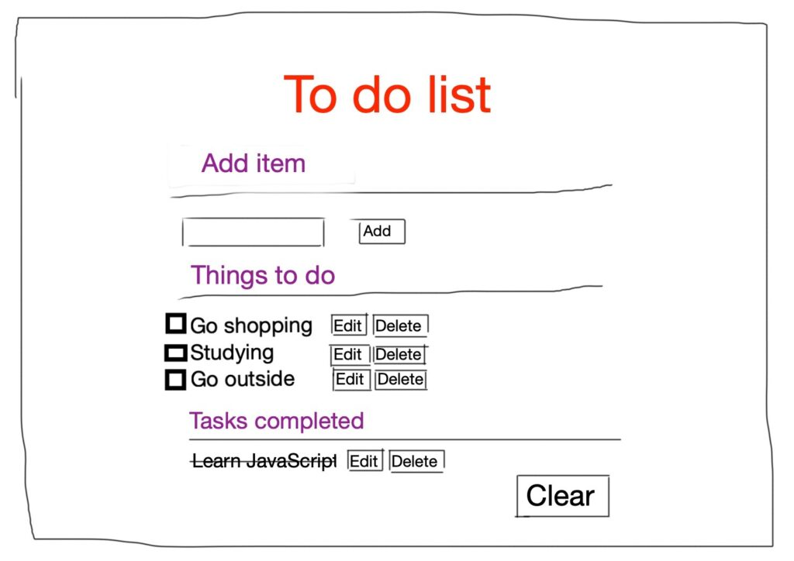
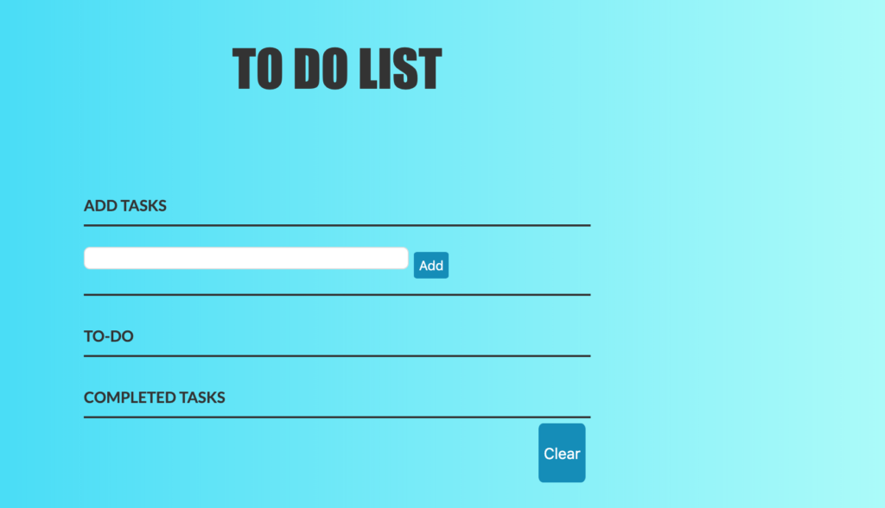
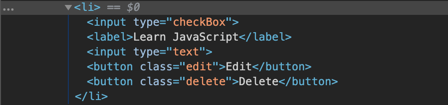
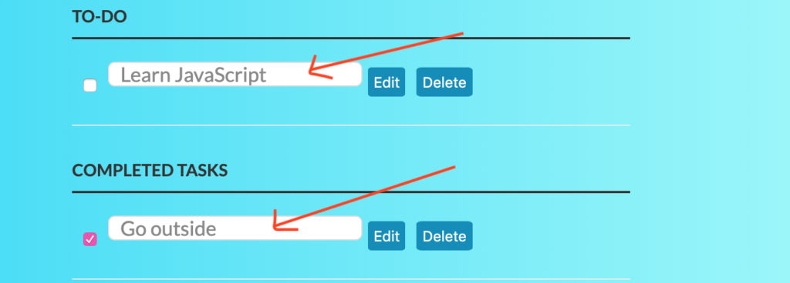
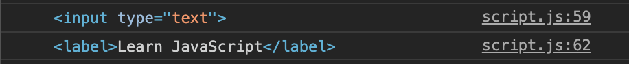
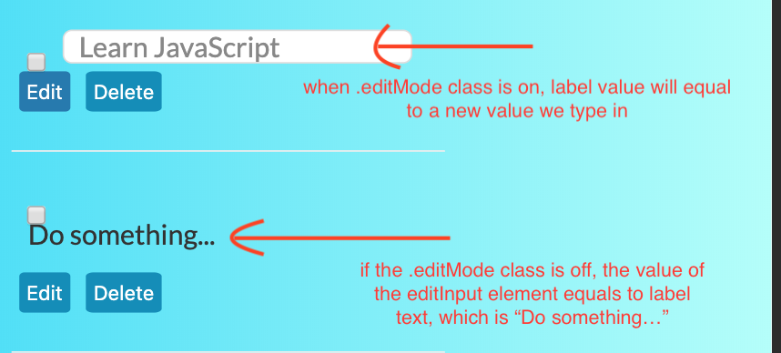
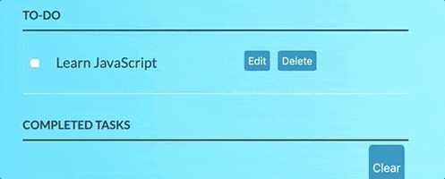
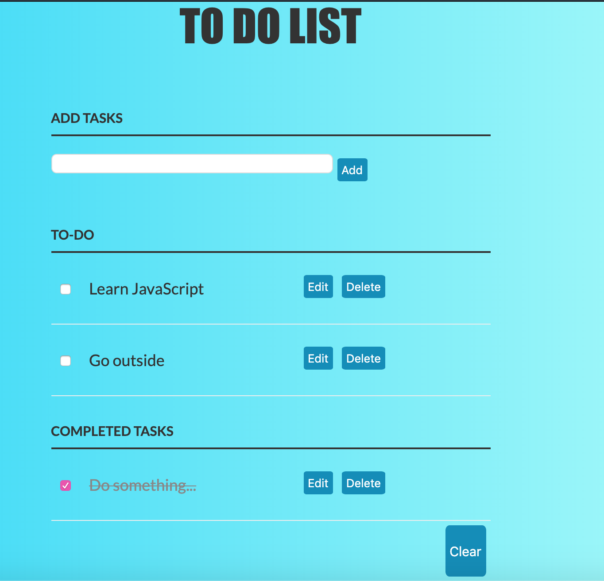

# todo-list

## Table of Contents

-   [todo list](#todo-list)

    -   [Features and Sketches](#eatures-and-sketches)

    -   [HTML Page](#html-page)

    -   [Styling with CSS](#styling-with-css)

    -   [Interactivity with JavaScript](#interactivity-with-javascript)

    -   [Summary](#summary)

### **Features and sketches**

To start off, let’s define the list of features our to-do list app has:

Add a task
Edit a task
Mark tasks as done
Delete a task
Clear all tasks
First off, out to do list app must need an option that we can add a task to the list, and later on, we can edit the task as we want. Next, after finishing a task, we should mark it as complete and move this task to another section. Also, we want to make our app more flexible, so we add another option to delete an unfinished task. After all, when the list becomes too verbose, we have a last option to clear all the tasks, both completed and uncompleted.

Before we dive in the coding process, let’s quickly sketch the outline of what we gonna do:



We first quickly create a HTML page which resembles to what we sketched, then we can add some styling to make the app a little more attractive, you can come up with your own CSS to make it nicer if you want. Finally, we slowly add some JavaScript code which orchestrate those features we have listed.

### **HTML PAGE**

Initially, we create an HTML page for what we intend to do, which is a to-do list. This HTML page should have some text displaying information about each section, i.g Add section, To-do section, and Completed section. Also, we need to add some buttons for editing, deleting and clearing the content.

```html
<html lang="en">
    <head>
        <meta charset="UTF-8" />
        <meta name="viewport" content="width=device-width, initial-scale=1.0" />
        <title>To-do list</title>
        <link rel="stylesheet" href="style.css" />
    </head>

    <body>
        <div class="container">
            <div class="section1">
                <h1 id="title">TO DO LIST</h1>
                <p>
                    <label for="new-task">Add Tasks</label>
                    <input id="new-task" type="text" />
                    <button id="add-button">Add</button>
                </p>
            </div>
            <div class="section2">
                <h3>To-do</h3>
                <ul id="incomplete-tasks"></ul>
            </div>
            <div class="section3">
                <h3>Completed Tasks</h3>
                <ul id="completed-tasks">
                    <li>
                        <input type="checkbox" checked="" />
                        <label>Learn JavaScript</label>
                        <input type="text" />
                        <button class="edit">Edit</button>
                        <button class="delete">Delete</button>
                    </li>
                </ul>
            </div>
            <div class="section4">
                <button id="clear">
                    <p>Clear</p>
                </button>
            </div>
        </div>
        <script src="script.js"></script>
    </body>
</html>
```

This is done for our HTML file. You should familiar with HTML code above and easily understand what it’s about. We have created a div container to hold all of our main elements, inside this div we have 4 sub divs for each section of the page. We need to retrieve the HTML element in our JavaScript file, hence the ids we define here make this process easier. We also have linked to a CSS file and a JavaScript named style.css and script.js respectively.

### **STYLING WITH CSS**

Before jump into JavaScript, to make the app is little more attractive, we need to decorate our page by using CSS. You can custom the CSS page if you want:

```css
body {
    background: #fff;
    color: #333;
    font-family: Lato, sans-serif;
    background: #b2fefa;
    /* fallback for old browsers */
    background: -webkit-linear-gradient(to right, #0ed2f7, #b2fefa);
    /* Chrome 10-25, Safari 5.1-6 */
    background: linear-gradient(to right, #0ed2f7, #b2fefa);
    /* W3C, IE 10+/ Edge, Firefox 16+, Chrome 26+, Opera 12+, Safari 7+ */
}

#title {
    margin-top: 5px;
    font-size: 50px;
    font-family: Impact, Haettenschweiler, "Arial Narrow Bold", sans-serif;
    text-align: center;
}

.container {
    display: block;
    width: 40vw;
    margin: 50px auto 0;
}

ul {
    margin: 0;
    padding: 0;
}

li * {
    float: left;
}

li,
h3 {
    clear: both;
    list-style: none;
}

input,
button {
    outline: none;
}

button {
    background-color: #008cba;
    border: none;
    color: white;
    padding: 15px 32px;
    text-align: center;
    text-decoration: none;
    display: inline-block;
    padding: 5px;
    margin: 5px;
    font-size: 13px;
    border-radius: 10%;
}

button:hover {
    background: #2079b0;
    text-decoration: none;
    cursor: pointer;
}

/* Heading */

h3,
label[for="new-task"] {
    color: #333;
    font-weight: 700;
    font-size: 15px;
    border-bottom: 2px solid #333;
    padding: 30px 0 10px;
    margin: 0;
    text-transform: uppercase;
}

input[type="text"] {
    margin: 0;
    font-size: 18px;
    line-height: 18px;
    height: 18px;
    padding: 10px;
    border: 1px solid #ddd;
    background: #fff;
    border-radius: 6px;
    font-family: Lato, sans-serif;
    color: #888;
}

input[type="text"]:focus {
    color: #333;
}

/* New Task */

label[for="new-task"] {
    display: block;
    margin: 0 0 20px;
}

input#new-task {
    float: left;
    width: 318px;
}

/* Task list */

li {
    overflow: hidden;
    padding: 20px 0;
    border-bottom: 1px solid #eee;
}

li > input[type="checkbox"] {
    margin: 0 10px;
    position: relative;
    top: 15px;
}

li > label {
    font-size: 18px;
    line-height: 40px;
    width: 237px;
    padding: 0 0 0 11px;
}

li > input[type="text"] {
    width: 226px;
}

li > .delete:hover {
    color: #cf2323;
}

/* Completed */

#completed-tasks label {
    text-decoration: line-through;
    color: #888;
}

/* Edit Task */

ul li input[type="text"] {
    display: none;
}

ul li.editMode input[type="text"] {
    display: block;
}

ul li.editMode label {
    display: none;
}

#clear {
    font-size: 15px;
    float: right;
    text-align: center;
}
```

We’ll get this result of we run this code:



### **INTERACTIVITY WITH JAVASCRIPT**

**Inatial Selected Elements**

To make our to-do list usable, we need to write JavaScript. As we can see in the image above, we need to add a new task, make it available to the to-do section, move it to the completed-tasks section if it marked as complete, then delete all the visual display items from the to-do and the complete tasks after the clear button is clicked. To facilitate those activities, we select the corresponding elements as we do right here inside the JavaScript file:

```javascript
let taskInput = document.getElementById("new-task"); // new-task
let addButton = document.getElementById("add-button"); //first button
let incompleteTasks = document.getElementById("incomplete-tasks"); //incomplete-tasks
let completedTasks = document.getElementById("completed-tasks"); //completed-tasks
let clearButton = document.getElementById("clear");
```

**ADD TO-DO**

The next thing we need to do is to create the first method which lets us add a task to the to-do list:

```javascript
let addTask = function () {
    if (taskInput.value == "") {
        alert("Task to be added should not be empty!");
        return;
    }
    let listItem = createNewTask(taskInput.value);
    incompleteTasks.appendChild(listItem);
    bindTaskEvents(listItem, taskCompleted);
    taskInput.value = "";
};
```

Let’s break down what happens here. First, we check whether to enter a non-empty task, if so, we proceed the next lines, otherwise we alert that the input should not empty and return.

Then we create a variable **listItem** which holds a task element. Because a task element may involve some other elements such as an edit button or a delete button, hence we create a function to make our addTask function less cumbersome. This **createNewTask** function takes one argument, which is a task we type in. Remember the **_incompleteTasks_** element? In the seventh line, we append listItem as a new child element li to the incompleteTasks which itself is a **ul** tag element by **appendChild** method. On line ninth, we clear the input after the user hitting the button.

On line eighth, we now call another function which is **bindTaskEvents**, what this function does is to take 2 argument, first one is the **listItem** on the 2rd line, and also a function **taskCompleted** and move the task around between **inComplete** and **completed** section. If the task is just added to the to-do section then it hasn’t completed yet, why we pass taskCompleted as the second argument? Let’s find out by look inside the **bindTaskEvents** and some other related functions.

But before we do it, let’s quickly add a single line of code to bind **addButton** to the EventListener:

```javascript
addButton.addEventListener("click", addTask);
```

Every time the **addButton** is clicked, the **addTask** function will be called, notice that we don’t have to use () to call a function inside the **addEventListener** method.

**CREATENEWTASK FUNCTION**

```javascript
let createNewTask = function (taskName) {
    // create List Item
    let listItem = document.createElement("li");
    // input checkbox
    let checkBox = document.createElement("input");
    // label
    let label = document.createElement("label");
    // input (text)
    let editInput = document.createElement("input");
    // button.edit
    let editButton = document.createElement("button");
    // button.delete
    let deleteButton = document.createElement("button");

    //Each element needs modified
    checkBox.type = "checkBox";
    editInput.type = "text";
    editButton.innerText = "Edit";
    editButton.className = "edit";
    deleteButton.innerText = "Delete";
    deleteButton.className = "delete";
    label.innerText = taskName;
    listItem.appendChild(checkBox);
    listItem.appendChild(label);
    listItem.appendChild(editInput);
    listItem.appendChild(editButton);
    listItem.appendChild(deleteButton);

    return listItem;
};
```

We call the **createNewTask** function on the sixth line of **addTask** function. This **createNewTask** function is a utility function for us to create a bunch of new elements, first off we create a new **li** element and some other elements by using the **createElement** method, then we use **appendChild** method again to add some children to this **li** container. Finally, we return this element, **listItem**.

If we pass in a value such as “Learn JavaScript” to the **createNewTask** function, then if this function is called, the return element will look like this:



You can easily inspect your page if you want by using CMD+SHIFT+J (in macOS) or Ctrl+Shift+J(in Windows). There is a tab named “Elements” where elements of the page stored there.

**BINDTASKEVENTS FUNCTION**

The function **bindTaskEvents** is responsible for firing some events such as edit and delete. It also helps us to move an item from the incomplete section to the finished one:

```javascript
let bindTaskEvents = function (taskListItem, checkBoxEventHandler) {
    // select listitems chidlren
    let checkBox = taskListItem.querySelector('input[type="checkbox"]');
    let editButton = taskListItem.querySelector("button.edit");
    let deleteButton = taskListItem.querySelector("button.delete");
    //bind editTask to edit button
    editButton.onclick = editTask;
    //bind deleteTask to delete button
    deleteButton.onclick = deleteTask;
    //bind checkBoxEventHandler to checkbox
    checkBox.onchange = checkBoxEventHandler;
};
```

This function takes 2 parameters, the first one is the task item, which is the item we create by the **createNewTask** method. The second one is used to flip the state of the item, from incomplete to finished and vice versa.

In the third line, the **checkBox** variable is used to store the element with the type of checkbox, which we can click on or off to mark the item as incomplete or completed. In the lines after, we select the edit and delete buttons (which are elements inside the **taskListItem** element) and store them to the **editButton** and **deleteButton** correspondingly. Keep in mind that the **querySelector** method only returns the first element that matches the specified selectors. Since our **taskListItem** just has one checkbox, one edit button, and one delete button, so we don’t need to worry about it much.

Next, we want when users click to the edit button, then it will let users change the content of the task, that’s why **onclick** comes in and used for this purpose. Both **editTask** and **deleteTask** are two other functions, one let us modify the content, the other when is called will make the content vanished.

Let’s recall one line in the **addTask** function, where we call the **bindTaskEvents** function:

```javascript
bindTaskEvents(listItem, taskCompleted);
```

This line of code might be confusing at first, but if you mull over, it will make sense. The **bindTaskEvents** has 2 parameters, one is **taskListItem** and one is **checkBoxEventHandler**, respectively we pass in it two arguments, which are **listItem** and **taskCompleted**, now move back to the last line of **bindTaskEvents** method:

```javascript
checkBox.onchange = checkBoxEventHandler;
```

If we change the checkBoxEventHandler with the function argument:

```javascript
checkBox.onchange = taskCompleted;
```

The **onchange** event will activate when the value of an element has been changed. For checkboxes, the **onchange** event occurs when the checked state has been changed. Thus, it makes sense when we call the **taskCompleted** function when the value of the checkbox has been changed.

**EDIT TASK**

As we stated, when we click to the edit button, it allows us to change the content of a task, here is how we define the editTask function:

```javascript
let editTask = function () {
    let listItem = this.parentNode;
    let editInput = listItem.querySelector("input[type=text]");
    let label = listItem.querySelector("label");
    let containsClass = listItem.classList.contains("editMode");

    // if the listItem element contains the editMode class
    if (containsClass) {
        //Switch from .editMode
        //label text become the input's value
        label.innerText = editInput.value;
    } else {
        //Switch to .editMode
        //input value becomes the labels text
        editInput.value = label.innerText;
    }
    //Toggle .editMode class on and off
    listItem.classList.toggle("editMode");
};
```

Let’s break down this code step-by-step. First off, you need to understand how the this keyword behaves in different scenarios, I already wrote a comprehensive article about the “**this**” keyword here. We need to trace where the **editTask** function has been called, now we need to refer back to the line fourth and the seventh line of the **bindTaskEvents** function:

```javascript
let editButton = taskListItem.querySelector("button.edit");
editButton.onclick = editTask;
```

Here the this context referring to is the edit button. Calling **this.parentNode** returns a parent element of this node, which is a **li** element, you can also use console.log to see the result.

On the third line, we use the **querySelector** method to match the input tag with the type of text, this can be either in incomplete or completed section depended on where we call the function (we have 2 other functions **taskCompleted** and **taskIncomplete** both call **bindTaskEvents** function):



On the next line, we select the label, this label holds the content of the task and store to the **label** variable, we can use the console.log to display those elements to the console:



The **classList.cotains** method returns **true** if the **listItem** element contains the class named **editMode**, otherwise, return **false**. Then we check if the editMode class exists, if it does, we set the edit input value to the label text value, otherwise if **editMode** doesn’t exist, we take the label text as the edit input value. For example:



The **classList** property returns all the classes of an element and its method toggle will let us **toggle** on and off a class, in our case, it’s the **editMode** class. When the edit button is clicked (which we bind the **onclick** event to this button on **bindTaskEvents** function), then the editMode class will append to the class list of **listItem** element, if click again, this class will disappear.


**DELETE TASKS**

Next, we need to find a way to delete a task, we already see the deleteTask function is called in the bindTaskEvents function:

```javascript
let deleteTask = function () {
    let listItem = this.parentNode;
    let ul = listItem.parentNode;
    ul.removeChild(listItem);
};
```

This function has a variable named **listItem** which stores exactly the same thing as we did in the **editTask** function, **this.parentNode** here also returns a **li** element and we access to the parent **ul** of this element then store it to the **ul** variable. Finally, we eliminate this li element on its parent **ul** by using the **removeChild** method.

**MARK A TASK AS COMPLETED**

We are closer to the end, the taskCompleted helps us move a task from the to-do section to the completed tasks section.

```javascript
let taskCompleted = function () {
    //When the Checkbox is checked
    //Append the task list item to the #completed-tasks ul
    let listItem = this.parentNode;
    completedTasks.appendChild(listItem);
    bindTaskEvents(listItem, taskIncomplete);
};
```

On line 6th, the **bindTaskEvents** will move the listItem from the completed section to the incomplete section of checkbox is unchecked (we already explain the bindTaskEvents function).

**MARK A TASK AS INCOMPLETE**

The **taskIncomplete** function looks identical to the **taskComplete** function, except we call the **bindTaskEvents** with **taskCompleted** as the second argument:

```javascript
let taskIncomplete = function () {
    //When the checkbox is unchecked appendTo #incomplete-tasks
    let listItem = this.parentNode;
    incompleteTasks.appendChild(listItem);
    bindTaskEvents(listItem, taskCompleted);
};
```

For better envision, let’s quickly take a look at how **taskComplete** and **taskIncomplete** perform in action:



**CLEAR ALL THE TASKS**

This is the last function of our to-do list app, when a clear button is activated, it will annihilate all the tasks both in the incomplete and completed sections.

```javascript
let clear = function () {
    incompleteTasks.innerHTML = "";
    completedTasks.innerHTML = "";
};
clearButton.addEventListener("click", clear);
```

Everything we need to do is to access **incompleteTasks** and **completedTasks** variable, set their content to an empty string by using innerHTML property. Outside the function, when we click the **clearButton** function, this clear function will be involved.

PUT ALL PIECES TOGETHER

Now we have done writing JavaScript, let’s synthesize all the functions together:

```javascript
let taskInput = document.getElementById("new-task");
let addButton = document.getElementById("addButton");
let incompleteTasks = document.getElementById("incomplete-tasks");
let completedTasks = document.getElementById("completed-tasks");
let clearButton = document.getElementById("clear");
let createNewTask = function (taskName) {
    let listItem = document.createElement("li");
    let checkBox = document.createElement("input");
    let label = document.createElement("label");
    let editInput = document.createElement("input");
    let editButton = document.createElement("button");
    let deleteButton = document.createElement("button");

    checkBox.type = "checkBox";
    editInput.type = "text";
    editButton.innerText = "Edit";
    editButton.className = "edit";
    deleteButton.innerText = "Delete";
    deleteButton.className = "delete";
    label.innerText = taskName;
    listItem.appendChild(checkBox);
    listItem.appendChild(label);
    listItem.appendChild(editInput);
    listItem.appendChild(editButton);
    listItem.appendChild(deleteButton);

    return listItem;
};
let addTask = function () {
    if (taskInput.value == "") {
        alert("Task to be added should not be empty!");
        return;
    }
    let listItem = createNewTask(taskInput.value);
    incompleteTasks.appendChild(listItem);
    bindTaskEvents(listItem, taskCompleted);
    taskInput.value = "";
};

let editTask = function () {
    let listItem = this.parentNode;
    let editInput = listItem.querySelector("input[type=text]");
    let label = listItem.querySelector("label");
    let containsClass = listItem.classList.contains("editMode");
    if (containsClass) {
        label.innerText = editInput.value;
    } else {
        editInput.value = label.innerText;
    }
    listItem.classList.toggle("editMode");
};
let deleteTask = function () {
    let listItem = this.parentNode;
    let ul = listItem.parentNode;
    ul.removeChild(listItem);
};
let taskCompleted = function () {
    let listItem = this.parentNode;
    completedTasks.appendChild(listItem);
    bindTaskEvents(listItem, taskIncomplete);
};

let taskIncomplete = function () {
    let listItem = this.parentNode;
    incompleteTasks.appendChild(listItem);
    bindTaskEvents(listItem, taskCompleted);
};
addButton.addEventListener("click", addTask);
let bindTaskEvents = function (taskListItem, checkBoxEventHandler) {
    let checkBox = taskListItem.querySelector('input[type="checkbox"]');
    let editButton = taskListItem.querySelector("button.edit");
    let deleteButton = taskListItem.querySelector("button.delete");
    editButton.onclick = editTask;
    deleteButton.onclick = deleteTask;
    checkBox.onchange = checkBoxEventHandler;
};

let clear = function () {
    incompleteTasks.innerHTML = "";
    completedTasks.innerHTML = "";
};
clearButton.addEventListener("click", clear);
```

Finally, our achievement might look like this:



### **summary**

we have learned how to create a simple to-do list app with plain JavaScript. First off, it’s judicious to not go directly to the coding process, but rather sketch a demo quickly first to get a general outline of what we should do. We have listed several features to our app and we implemented all of them in JavaScript. If a function is too long to write and some of its components are possible to be written as a separate function, then we might have to find a way to proceed. We learned how to use JavaScript to interact with Document Object Model (DOM) to make our app interactable, how to activate an event using addEventListiner method.
